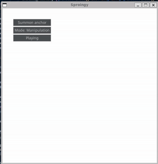

# Springpy

## Table of contents
- [Springpy](#springpy)
  - [Table of contents](#table-of-contents)
- [Main takeaways](#main-takeaways)
- [Controls:](#controls)
  - [Modes](#modes)
    - [Manipulation Mode](#manipulation-mode)
    - [Spring Mode](#spring-mode)
    - [Anchor Mode](#anchor-mode)
    - [Deletion Mode](#deletion-mode)
- [End to end tutorial](#end-to-end-tutorial)
  - [What to install:](#what-to-install)
  - [To run](#to-run)
- [To-do:](#to-do)
# Main takeaways
Going into this I was mainly just trying to implement a spring physics simulation, but after working on it, I learned so much more than just spring physics. Here are some of the things that I learned throughout the process of developing this
- An app framework should give the user access to the following timings
  - Manual: whenever the user invokes a specific function
  - Event loop: whenever the app events are being processed
  - Task loop: whenever we perform functions that correlate to delta time
  - Draw loop: whenever we are drawing items on the screen
- The user should be able to inject their own functions to build upon the base application
  - Similarily done here  where the gui, updating, and drawing logic was appeneded to each of the corresponding lists
- For a physics simulation, a larger timestep leads to a faster simulation and vice versa

# Controls:
- The GUI has 3 buttons:
  - Summon anchor button: would spawn an anchor in a random place with a random velocity
  - Mode button: cycles through the modes
    - There are 4 modes in total (Manipulation, Spring, Anchor, and Deletion)
  - Pause button: toggles between simulation pausing and unpausing
## Modes
### Manipulation Mode
- Left Clicking and dragging around an anchor would move it
- Right clicking an anchor would toggle whether the anchor is affected by forces
### Spring Mode
- Left clicking an anchor and releasing left click at another anchor would create a spring between the two anchors 
- Scrolling up and down would increase and decrease the spring stiffness
### Anchor Mode
- Left clicki8ng would create a new anchor
- Scrolling up and down would increase and decrease the anchor size/mass
### Deletion Mode
- Right clicking a spring deletes it
- Left clicking an anchor would delete it
# End to end tutorial
- To setup everything here is each terminal command and it's explanation
## What to install:
- Pygame (A way to draw and manage the window and simulator)
```bash
pip install --user pygame
```
- Pygame GUI (A way to have GUI for the windows managed by Pygame)
```bash
pip install --user pygame_gui
```
- Numpy (A vector/matrix math library)
```bash
pip install --user numpy
```
## To run
```bash
python3 Springpy/Springpy.py
```
# To-do:
- [ ] Add a way to select existing springs and anchors
- [ ] Add a way to manipulate already existing springs and anchors
- [ ] Make the C++ version of the application framework
- [ ] Make the C++ version of the spring simulation app
